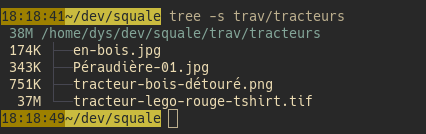
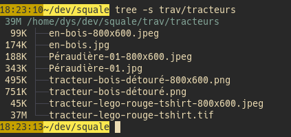

# squale

[![CI][s3]][l3] [![MIT][s2]][l2] [![Latest Version][s1]][l1] [![Chat on Miaou][s4]][l4]

[s1]: https://img.shields.io/crates/v/squale.svg
[l1]: https://crates.io/crates/squale

[s2]: https://img.shields.io/badge/license-MIT-blue.svg
[l2]: LICENSE

[s3]: https://travis-ci.org/Canop/squale.svg?branch=master
[l3]: https://travis-ci.org/Canop/squale

[s4]: https://miaou.dystroy.org/static/shields/room.svg
[l4]: https://miaou.dystroy.org/3768?Rust


A small utility upscaling or downscaling images.

## Installation

```bash
cargo install squale
```

## Usage

Specify the dimensions that output images must fit and pass image path(s) as argument:

```bash
squale --fit 800x600 trav/tracteurs/*
```

Squale filters out non images and files whose name looks like its own output.


Generated images are named according to the specified fitting rectangle.


For example, assuming you have those files:



After running the command above, you'll get




List of arguments is available on `squale --help`

## Output images

Images are scaled up or down with the Lanczos sampling algorithm (window 3) which isn't terribly fast but gives excellent results.

Scaled PNG, ICO, BMP images are saved as PNG.

Other kinds of images are saved as JPEG. Default quality is 85 but it can be changed with the `--jpeg-quality` parameter.

